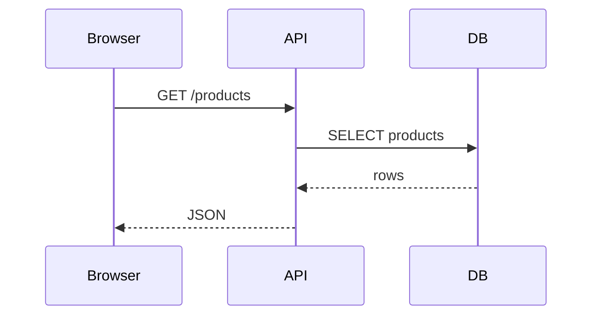

# Documenting Technical Solutions - Handbook

Good technical documentation reduces the time needed to understand a system again and limits knowledge that exists only in one person's head. In practice, separate tutorials, task-oriented how-to guides, reference and explanation instead of forcing every purpose into one document.

Related topics: [GitHub](techhandbook:doc-014), [Software Testing](techhandbook:doc-049), [End-to-End Web Application Troubleshooting](techhandbook:doc-057) and [AI Prompting](techhandbook:doc-002).

## 1. Why document

Technical documentation reduces repeated explanation and makes systems easier to operate, maintain and hand over.

Good documentation answers:

- what this system is,
- how to run it,
- how it is structured,
- how to change it,
- how to recover from failure,
- why important decisions were made.

## 2. README

A good README should explain:

- purpose,
- prerequisites,
- quick start,
- build,
- run,
- test,
- configuration,
- links to deeper docs.

## 3. Quick start

A useful quick start gets a new developer from zero to a running system quickly.

Example:

```bash
git clone REPOSITORY
cd project
cp .env.example .env
docker compose up -d
go test ./...
go run ./cmd/server
```

## 4. Repository structure

Document important directories.

Example:

```text
cmd/          application entry points
internal/     private application packages
web/          frontend/static files
migrations/   database migrations
docs/         documentation
deploy/       deployment files
```

## 5. Configuration

Document:

- config files,
- environment variables,
- required secrets,
- defaults,
- production differences.

Do not put real secret values into docs.

## 6. ADR

ADR = Architecture Decision Record.

An ADR records an important technical decision and its context.

Typical structure:

```text
Title
Status
Context
Decision
Consequences
```

## 7. ADR example

# ADR-004: PostgreSQL as the Primary Database

## Context

The application requires transactions, relational queries and mature backup tooling.

## Decision

Use PostgreSQL as the primary transactional database.

## Consequences

Positive:

- strong SQL support,
- transactions,
- mature ecosystem.

Negative:

- schema migrations must be managed,
- database operations become part of deployment.

## 8. Why ADR matters

Without ADRs, teams remember decisions but forget the reasons.

Later, old choices can look irrational even when they were sensible at the time.

## 9. RFC

RFC documents a proposed technical change before implementation.

Useful for:

- major architecture changes,
- new public APIs,
- migrations,
- infrastructure redesign,
- team-wide conventions.

## 10. Non-goals

State what a proposal explicitly does not try to solve.

Example:

```text
Non-goals:
- redesign authentication,
- change the public API,
- replace PostgreSQL.
```

This prevents uncontrolled scope growth.

## 11. Context diagram

A context diagram shows the system and its external actors.

Example:

```text
User
↓
Web application
↓
Payment provider
↓
Email service
```

## 12. C4 - idea

C4 models architecture at several levels:

- Context,
- Container,
- Component,
- Code.

Use only as much detail as the audience needs.

## 13. Sequence diagram

A sequence diagram shows interactions over time.

Example:

```text
Browser → API: POST /login
API → Database: read user
Database → API: user
API → Browser: session cookie
```

## 14. API documentation

Document:

- endpoint,
- method,
- authentication,
- request,
- response,
- status codes,
- error format,
- examples.

## 15. OpenAPI

OpenAPI describes HTTP APIs in a machine-readable format.

It can generate:

- interactive documentation,
- client code,
- schema validation,
- tests.

Keep the specification synchronized with the real API.

## 16. Runbook

A runbook is an operational procedure.

Examples:

- deploy application,
- restart service,
- rotate certificate,
- restore database,
- respond to disk-full incident.

## 17. Good runbook

A good runbook includes:

- prerequisites,
- exact commands,
- expected output,
- validation,
- rollback,
- escalation conditions.

## 18. Troubleshooting guide

Troubleshooting docs should describe symptoms, checks and likely causes.

Example:

```text
Symptom:
502 from nginx

Check:
1. systemctl status app
2. journalctl -u app
3. curl localhost:8080
4. nginx -t
```

## 19. Changelog

A changelog describes user- or operator-visible changes between versions.

Do not use raw Git history as the only changelog.

## 20. Versioning

Document how releases are versioned.

Examples:

- Semantic Versioning,
- calendar versioning,
- Git commit SHA,
- release tags.

## 21. Code comments

Comments should explain:

- why,
- constraints,
- non-obvious trade-offs.

Avoid comments that merely restate the code.

## 22. Living documentation

Documentation should change together with the code.

If a pull request changes:

- configuration,
- API,
- deployment,
- operations,

update the docs in the same change.

## 23. Diagrams as code

Tools such as Mermaid or PlantUML let diagrams live in version control.

Example:



## 24. Definition of Done

Documentation can be part of the completion criteria.

Example:

```text
Done when:
- code works,
- tests pass,
- config docs updated,
- runbook updated,
- migration documented.
```

## 25. Minimal set for a small project

A small project should usually have:

```text
README.md
.env.example
docs/architecture.md
docs/runbook.md
CHANGELOG.md or release notes
```

For larger decisions, add ADRs.

## 26. What you should know

You should understand:

- README structure,
- quick starts,
- configuration docs,
- ADRs,
- RFCs,
- non-goals,
- architecture diagrams,
- API docs,
- OpenAPI,
- runbooks,
- troubleshooting guides,
- changelogs,
- versioning,
- documentation-as-code.

The key rule: document the information that future you or another operator will need when the system is failing at 2 a.m.

## Sources and further reading

- Diátaxis: https://diataxis.fr/
- Write the Docs: https://www.writethedocs.org/guide/
- OpenAPI Specification: https://spec.openapis.org/oas/latest.html
